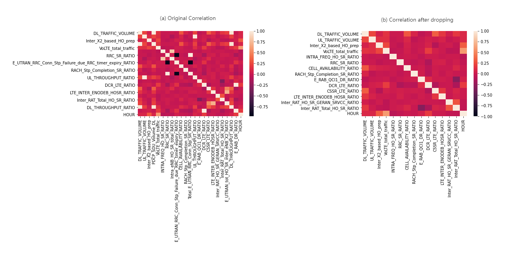
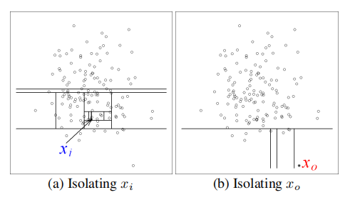

[TOC]


# 1. Project Introduction

## 1.1 Background

Telecom networks are generating huge amounts of data coming from traffic on this network due to customer calls and services consumptions. This data contains a lot of valuable information that enable machine learning models to learn from and predict outcomes to maintain service quality.

The main purpose of the proposed project is detecting anomalies and predicting incident/failures on the network in real time. 

In order to achieve the target,  work is to be performed on comparing and validating the results of three approaches: 1) Auto-Encoder (Deep learning - Neural network approach) 2) Isolation Forest and 3) the combination of the two previous approaches. Finally, a conclusion about  the optimal approach needs to be obtained.

This project is proposed by [B-Yond](https://www.b-yond.com/) and Ecole Mines Saint-Etienne, and will be under the joint guidance of the corporate mentor Mr. Michel  KAMEL and the school mentor Mr. Anis HOAYEK. 


## 1.2 Planification

The project starts on October 1, 2021 and ends on January 27, 2022, and  each week with 1~2 days of work on it is required.

The project is divided into three main parts,  the details and specifics/methodology are shown in the table below.

|           | Theoretical phase                                            | Practical phase                                              | Summarization phase                                          |
| --------- | ------------------------------------------------------------ | ------------------------------------------------------------ | ------------------------------------------------------------ |
| Objective | Understanding the theoretical background of the algorithm to be used | Data processing, model building, model performance analysis  | Summarize the work conducted, further improve/optimize the work if possible |
| Content   | Read the papers on *Isolation Forest* and *(Variational) Auto-Encoder* | 1. Understand the data and complete the processing of the data (missing value processing, feature engineering..)<br/>2. Build the three required models and get the corresponding indicators for evaluating sample anomalies<br/>3. Analyze the results of the three models and further propose methods to detect  anomalies | 1.Discuss the project results with the mentors<br/>2.Write project report |
| Date      | 2021.10.01-2021.10.24                                        | 2021.10.25 - 2022.12.31                                      | 2022.1.1-2022.1.23                                           |


# 2. Work Conducted

## 2.1 Data preprocessing

### 2.1.1 Data understanding

In this project, we begin with a small sample dataset, which has only 8280 records.


In this data 26 features are measured, including time, cell id and some KPIs of LTE (Long Term Evolution, a wireless data communication technology standard).

These data come from 5 cells, that is, each cell contains 1656 records.

> `cell` : In the field of mobile communication, the area covered by wireless signals is called a *cell*, which generally refers to the area that can be covered by the signal of a base station.


First Let's check the null values in our dataset :

```
FEATURES												Num_null
---------------------------------------------------------------
index                                                         0
cell_id                                                       0
DL_TRAFFIC_VOLUME                                            21
UL_TRAFFIC_VOLUME                                            21
Inter_X2_based_HO_prep                                     3313
PDCP_SDU_Volume_DL                                         3313
VoLTE_total_traffic                                        3313
INTRA_FREQ_HO_SR_RATIO                                       40
RRC_SR_RATIO                                                 28
Intra_eNB_HO_SR_total_RATIO                                3321
E_UTRAN_RRC_Conn_Stp_Failure_due_RRC_timer_expiry_RATIO    3313
CELL_AVAILABILITY_RATIO                                      20
RACH_Stp_Completion_SR_RATIO                               3313
Total_E_UTRAN_RRC_Conn_Stp_SR_RATIO                        3313
Inter_RAT_HO_SR_UTRAN_SRVCC_RATIO                          5595
UL_THROUGHPUT_RATIO                                          28
E_RAB_QCI1_DR_RATIO                                        3324
DCR_LTE_RATIO                                                28
CSSR_LTE_RATIO                                               28
LTE_INTER_ENODEB_HOSR_RATIO                                1695
E_UTRAN_Inter_Freq_HO_SR_RATIO                             4967
Inter_RAT_HO_SR_GERAN_SRVCC_RATIO                          3989
Inter_RAT_Total_HO_SR_RATIO                                3731
E_UTRAN_tot_HO_SR_inter_eNB_X2_RATIO                       3347
DL_THROUGHPUT_RATIO                                          28
E_RAB_DR_RATIO                                             3314
```

In the data, many variables have a large number of missing values! Usually, for missing values, we will either fill them using other means or delete features/records with many missing values. In our case, it can be seen that there is perhaps some correlation between these missing values (e.g., many variables have 3313 missing values). We will start with one point and then move on to consider how to deal with them.

After a brief glance at the data file in Excel, we found this:


Apparently, these missing values are concentrated in a certain region. More specifically, for this cell, it seems that it does not contain certain KPIs. In the next step, we can consider processing the data of different cells separately.

> Viewing data in Excel is a very simple way (so simple that it is sometimes overlooked) to provide some information in a very visual way


Then we'll look into the data distribution : 


It can be seen that the data corresponding to the features are all continuous. For some of the features related to "ratio", the data set is distributed around 1 or 0 (in the above figure it looks like a binary distribution, but it has actually continuous values). 

Therefore, we can later use some missing value padding methods for continuous numeric variables.


### 2.1.2 Look into data by `cell_id`

#### (1) Features with too many missing values

Based on the above discussion, we looked at the missing values in each cell data


It is obvious that for the third and fourth cell in the above figure, they have much more missing values on certain features.  To see it more clearly, we can print out only those who do not have too many NaN values (less than 30% for example).


Now, we will look into the distribution of those columns whose NaN values need to be filled later.


For different distributions, we can propose the following strategies:

- fill with <u>mode</u> : for some features with very concentrated distribution (e.g. `Inter_RAT_HO_SR_GERAN_SRVCC_RATIO`, row3, col1 in figure above)

- fill with <u>mean</u> : for features with relatively large variance (e.g. `VoLTE_total_traffic`, row1, col2 in figure above)

- fill with <u>specific value</u> depending on the definition of feature : the data distribution of certain features varies widely across cells (e.g. `E_UTRAN_Inter_Freq_HO_SR_RATIO`, row3, col3 in figure above. Its left and right parts are actually the distribution in two different cells).

  In our case, the <u>median</u> is used. This is because it is tested that the median of these characteristics is very close to the center of one of the distributions. Of course, we can be very flexible in our approach for this type of features


#### (2) Highly relevant features

When modeling, features that are highly correlated can cause redundancy. We can simplify the model by keeping only the features with weak correlation.



Since our data itself is not particularly high dimensional and the correlation between the features presented in each cell is different, we need to be careful when removing them. To do this, we can record the features that are identified as redundant in each cell, and then remove those that are redundant for most cells (4 cells out of 5, in our case), and there are 6 features meet the criteria to delete.


### 2.1.3 Fill NaN & Add new features

According to the above analysis, we first remove the redundant feature values and then fill them according to different methods

On top of the above, we will also consider the effects of time of day ( hour of a day) and cell.

Finally, we get 8279 data containing 20 features.


## 2.2 Modeling

### 2.2.1 Isolation Forest

#### (1) Introduction

The isolation forest algorithm is proposed for detecting outliers. Regarding the anomalies, they are considered to have the following two characteristics:

- they are the minority consisting of fewer instances
- they have attribute-values that are very different from those of normal instance

In brief, the solution idea proposed by the isolation forest is as follows:

1. Randomly select a feature and its segmentation value
2. Recursively segment the dataset only until it is indivisible/attains maximum depth

In general, the more easily the point is to be isolation the more likely it would be an anomaly.



#### (2) Implementation

Since there is already a wrapped isolation forest algorithm in python's `sklearn` library, we can use it directly.  Here, we use the default parameters:

```python
from sklearn.ensemble import IsolationForest

IF=IsolationForest(n_estimators=150, 
                      max_samples ='auto', 
                      max_features=1,random_state=42)
```

> Note: For this algorithm, we do not need to scale the features

After the model is trained, we use it to calculate the anomaly score for each sample (the higher the score, the more likely it is to be an outlier)


### 2.2.2 Variational Auto-Encoder (VAE)

#### (1) Introduction

Before getting into VAE, let's get to see its simplified version first - the *AutoEncoder* (AE).

**AutoEncoder** is based on neural networks. Its core idea is to take the features of the learned data and thus reduce the dimensionality (usually in a non-linear way), and this process is called ***encoding***. And to retrieve them from the "compressed" data, we need to perform the ***decoding*** process. Of course, the decompressed data will not be exactly the same as the original one. Therefore, the main purpose of training the model is to reduce the discrepancy between the two.


The autoencoder is a single-valued mapping model (compressing a sample point into another point and then retrieving it), while the variational autoencoder looks for the mapping relationship of the distribution. Specifically, the VAE learns their distribution from the "compressed points", so that any point in this "compressed space" can find its counterpart in the original space.


Based on the above features, we can apply AE to detect outliers and use VAE to generate new data that is not available in reality. Although our aim is to detect anomalies, given the other requirements of this project, we will also use the VAE model.

#### (2) Implementation

As before, we start with a relatively simple model structure. Specifically, in the encoder and decoder, we just use two dense layers:


For the VAE model, we need to calculate the difference (which we call "loss") between the reconstructed data and the original data, and outliers tend to have larger losses. 


### 2.2.3 Combination of *IF* and *VAE*

#### (1) Stacking 

In *Ensemble Learning*, there is a method called "*stacking*", which means that the output of one model is used as the input of another. This provides us with a new way of thinking, and currently, there is no existing research on this approach.

Therefore, combining the above theory, we can easily come to the idea that, the output of the "encoder" can be used as input to the *IF* model. For this, we can interpret it as using the new features learned by VAE as input (they may be more representative than the original ones) and then isolating those points that are far from the majority with *IF* algorithm. 

And in this section, we keep exactly the settings of the two models above, but we won't use the "decoder" of the VAE model.

#### (2) Bagging

Also in integration learning, there is a method called "Bagging". It is a voting mechanism, that is, it considers multiple models equally and takes result of majority as the final answer. In this case, we do not need to reconstruct the new model. We only analyze the results of the above two existing models. Specifically, we can consider a sample as an outlier if :

- The IF model or the VAE model thinks it's abnormal
- OR : both models think it's abnormal


## 2.3 Result Evaluation 

In this section, we will analyze the output metrics (abnormal probabilities or losses) of the three models mentioned above.

### 2.3.1 Analysis on metrics obtained

#### (1) Distribution

|               | IF_score                                                     | VAE_loss                                                     | VAE_IF_score                                                 |
| ------------- | ------------------------------------------------------------ | ------------------------------------------------------------ | ------------------------------------------------------------ |
| mean          | 0.451213                                                     | 0.747234                                                     | 0.486291                                                     |
| std           | 0.030114                                                     | 2.107643                                                     | 0.039233                                                     |
| min           | 0.403969                                                     | 0.023347                                                     | 0.423997                                                     |
| 25%           | 0.428277                                                     | 0.194180                                                     | 0.458176                                                     |
| 50%           | 0.443766                                                     | 0.377740                                                     | 0.474988                                                     |
| 75%           | 0.471093                                                     | 0.776217                                                     | 0.508637                                                     |
| max           | 0.599004                                                     | 97.686493                                                    | 0.715104                                                     |
| visualization |  |  |  |

> Note: In the above visualization a box line plot is used, which uses a method called ***IQR*** (which we will explain in detail later).
>
> - the orange line represents the median
> - the upper and lower boundaries of the rectangle box represent the upper(Q3) and lower quartiles(Q1)
> - the two line segments outside of the box represent the upper and lower boundaries
> - the circles beyond the boundaries are considered as outliers.

It can be seen that the two algorithms related to isolation forest get similar results. And for the *VAE_loss*, there is a large discrepancy in its value (the mean value is 0.74 while the max value is 97.6). That is because the loss of VAE can be taken without an upper limit. 


#### (2) Interrelation

Next, we put the three metrics together to observe their interrelationship. Since the value range of *VAE_loss* differs significantly from the other two, we use color to indicate it (the darker the color, the larger the value).


It can be seen that：
1. In the lower left corner of the image ( x∈[0, 0.45] and y∈[0, 0.55] )
    the values of all three indicators are low, which means that it is less likely to be an outlier
2. In the upper part of the image (y>0.57) as well as in the right part (x>0.51), when both `IF_score` and `VAE_IF_score` have higher scores, `VAE_loss` also tends to have higher values (i.e., all three metrics are considered more likely to be anomalous)
3. x∈[0.46, 0.51] and y∈[0.47, 0.56] 
    `VAE_IF_loss` indicates high loss, but for the other two indicators, the same conclusion is not always reached

#### (3) Visualize metrics on original data

Since our original data is 20-dimensional, in order to visualize them, we can use *PCA* to downscale it to 2~3 dimensions. Of course, reducing the dimensionality will introduce some information loss, but we are here mainly to facilitate the demonstration of the results.

|      | IF_score                                                     | VAE_loss                                                     | VAE_IF_score                                                 |
| :--: | ------------------------------------------------------------ | ------------------------------------------------------------ | ------------------------------------------------------------ |
|  2D  |  |  |  |
|  3D  |  |  |  |

In the above figure, we compressed the original 20-dimensional data to 2~3 dimensions respectively for visualization, where the darker color indicates the higher possibility of anomaly. It can be seen that:

- **Isolation Forest** is good at finding out the data edges as well as very small clusters.

- **VAE** is very sensitive to clustering who is far away from majority

- **VAE+IF**: the difference in values is relatively small, but we can still find some points at the edges where the possibility of anomalies is high

  

### 2.3.2 Identification of anomalies 

#### IQR method

In descriptive statistics, the interquartile range (IQR) is **a measure of statistical dispersion**, which is the spread of the data. It is defined as the difference between the 75% and 25% percentiles of the data. 

Mathematically, we have:

- IQR = Q3 - Q1
- upper_bound = Q3 + 1.5*IQR
- lower_bound  = Q1 - 1.5*IQR

where Q1, Q3 are 25% and 75% quantile respectively. But in our case, the lower bound won't be used, since the lower the metric value is, the less possible a record will be an anomaly.


#### (1) Result - Stacking Model

To make it clear, we calculate the upper bound (threshold) and its corresponding quantile and get the following results:

|                        | IF_score  | VAE_loss  | VAE_IF_score |
| ---------------------- | --------- | --------- | ------------ |
| upper bound            | 0.54      | 1.65      | 0.58         |
| Corresponding Quantile | 98.90%    | 91.94%    | 97.26%       |
| Anomaly percentage     | **1.10%** | **8.06%** | **2.74%**    |

That is, if we use the IQR method to calculate the threshold for determining whether a sample is anomalous or not, then for each of the three models mentioned above, the proportion of outliers we obtain is 1.10%, 8.06% and 2.74%

It can be seen that the result obtained using a combination of the two models (IF + VAE) is between that of Isolation Forest and VAE. 


#### (2) Result - Bagging Model

If we count the number of times a sample is determined to be an outlier by the Isolated Forest model as well as the VAE model, we can get the following results

| Nb of being recorded as anomaly | Percentage | Explanation                             |
| ------------------------------- | ---------- | --------------------------------------- |
| 0                               | 91.6053%   | Not considered as anomaly               |
| 1                               | 07.6338%   | Considered as anomaly by IF **or** VAE  |
| 2                               | 00.7610%   | Considered as anomaly by IF **and** VAE |

This means that if there are `n` model(s) that consider a sample to be an outlier, we judge it to be an anomaly, and then the relationship between `n` and the proportion of anomalous samples is:

- `n` = 1 : **8.4%**, that is, the "union" of the 2 models' results

- `n` = 2 : **0.76%**, that is, the "intersection" of the 2 models' results

  

### 2.3.3 Conclusion

Based on the basic isolated forest and VAE models, we use two integrated learning methods, "stacking" and "bagging", with the former yielding results in between the results of the basic model and the latter falling outside this range.


But for this, we can't directly decide which result is better. In fact, we need further expert opinion (a priori knowledge) to determine the performance of the model.


# 3. Summary & Reflection

## 3.1 Problems encountered

### 3.1.1 Handling large number of missing values

About half of the features in the data provided have more than 40% missing values. How to handle them and minimize the impact on the distribution of the original data? I spent a lot of time on this problem. 

At first, I tried to start with understanding the physical meaning of the features. It would greatly simplify the problem if it could be simply filled with 0s or 1s (e.g., if there is a feature which records the number of communications, then for missing values we can simply fill it with 0s). Unfortunately, in our data, features are always related about the success rate of connections and some features seem to be correlated with each other. Therefore this approach is not suitable.

Consider that the time is recorded in the data. Next, I tried to use the interpolation method. However, some features are missing for the entire time period recorded.

At Mr. Hoayek's suggestion, I divided the data into cells and realized that the data was missing because some features were not recorded in a particular cell and were not "randomly" generated. In each region (cell), the distribution and correlation of the values of the features are more easily observed. On this basis, I was able to use the method mentioned in the previous section for the missing values.


### 3.1.2 Evaluation of model output

In this project, our model is unsupervised. This means that there are outliers in our data, but we do not know which and how many are. Therefore, even when the output of each model is available, it is not feasible to evaluate the performance of the model using concepts such as "accuracy" that are common in supervised learning.

For this, I visualized the results and calculated the percentage of records that are considered anomalous based on the models' output. Although these are not "precise" evaluation results, they still provide some degree of feedback on the performance of the model. This is why, in unsupervised learning, we need the a priori knowledge of experts to help us adjust and improve the model.


## 3.2 Knowledge acquired

### 3.2.1 Theoretical aspect

In the theoretical phase of this project, I learned the theoretical concepts of Isolation Forest and (Variational) Auto-Encoder. More importantly, from this starting point, I reviewed and learned more about statistics (mixed Gaussian models, cross-entropy...), and thus able to understand the models from a more "statistical learning method" perspective.

### 3.2.2 Practical aspect

In this project, I had the opportunity to apply knowledge about unsupervised learning in a practical scenario and to start the content of deep learning based on Tensorflow (Keras). Even though I didn't use very advanced techniques, it's still a very meaningful start for me, and I will continue to work in this field.


## 3.3 Possible improvements

This project is my initial exploration in anomaly detection, therefore I did not do a very deep exploration in the construction of the model (using very simple parameter settings instead). Therefore, in this regard, there is still more learning and improvement to be done.

In addition to that, the evaluation of unsupervised models is a very open problem in this project. In my previous studies, there was no experience in this area. In industry, there should be some established practices to follow, and it may also take into account the needs of "real-time applications". These are things that I can explore further based on the work I have done so far.
