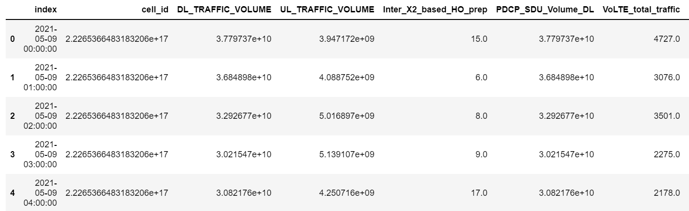
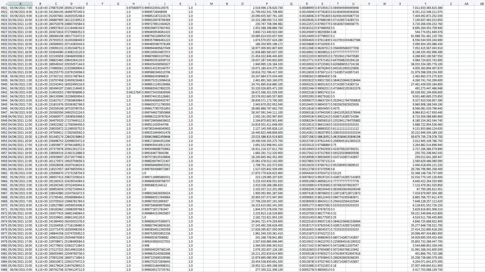
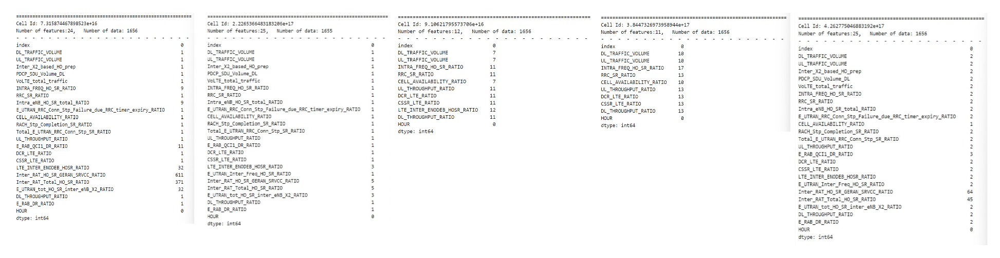
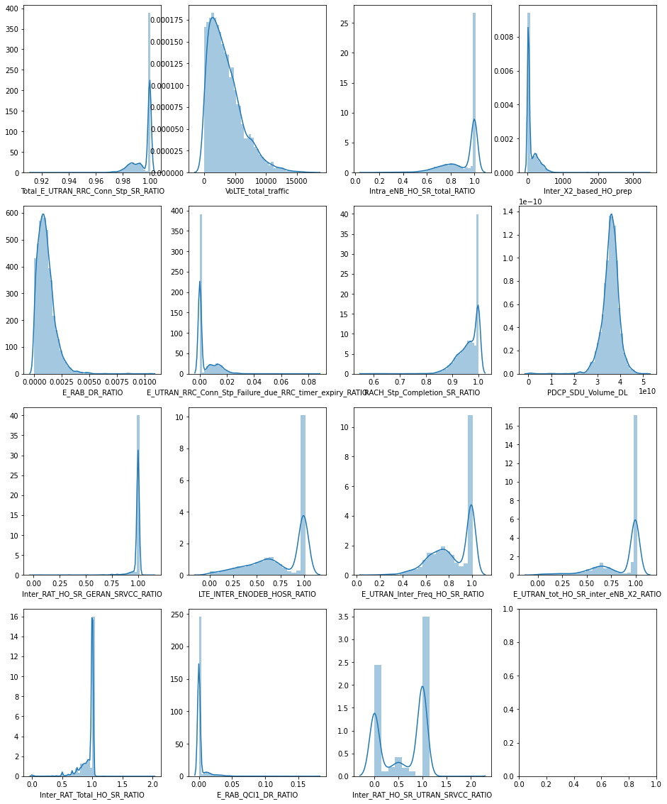

# 1. Data preprocessing

## 1.1 Data understanding

In this project, we begin with a small sample dataset, which has only 8280 records.



In this data 26 features are measured, including time, cell id and some KPIs of LTE (Long Term Evolution, a wireless data communication technology standard).

These data come from 5 cells, that is, each cell contains 1656 records.

> `cell` : In the field of mobile communication, the area covered by wireless signals is called a *cell*, which generally refers to the area that can be covered by the signal of a base station.


First Let's check the NaN values in our dataset :

```
index                                                         0
cell_id                                                       0
DL_TRAFFIC_VOLUME                                            21
UL_TRAFFIC_VOLUME                                            21
Inter_X2_based_HO_prep                                     3313
PDCP_SDU_Volume_DL                                         3313
VoLTE_total_traffic                                        3313
INTRA_FREQ_HO_SR_RATIO                                       40
RRC_SR_RATIO                                                 28
Intra_eNB_HO_SR_total_RATIO                                3321
E_UTRAN_RRC_Conn_Stp_Failure_due_RRC_timer_expiry_RATIO    3313
CELL_AVAILABILITY_RATIO                                      20
RACH_Stp_Completion_SR_RATIO                               3313
Total_E_UTRAN_RRC_Conn_Stp_SR_RATIO                        3313
Inter_RAT_HO_SR_UTRAN_SRVCC_RATIO                          5595
UL_THROUGHPUT_RATIO                                          28
E_RAB_QCI1_DR_RATIO                                        3324
DCR_LTE_RATIO                                                28
CSSR_LTE_RATIO                                               28
LTE_INTER_ENODEB_HOSR_RATIO                                1695
E_UTRAN_Inter_Freq_HO_SR_RATIO                             4967
Inter_RAT_HO_SR_GERAN_SRVCC_RATIO                          3989
Inter_RAT_Total_HO_SR_RATIO                                3731
E_UTRAN_tot_HO_SR_inter_eNB_X2_RATIO                       3347
DL_THROUGHPUT_RATIO                                          28
E_RAB_DR_RATIO                                             3314
```

In the data, many variables have a large number of missing values! Usually, for missing values, we will either fill them using other means or delete features/records with many missing values. In our case, it can be seen that there is perhaps some correlation between these missing values (e.g., many variables have 3313 missing values). We will start with one point and then move on to consider how to deal with them.

After a brief glance at the data file in Excel, we found this:



Apparently, these missing values are concentrated in a certain region. More specifically, for this cell, it seems that it does not contain certain KPIs. In the next step, we can consider processing the data of different cells separately.

> Viewing data in Excel is a very simple way (so simple that it is sometimes overlooked) to provide some information in a very visual way


Then we'll look into the data distribution : 


It can be seen that the data corresponding to the features are all continuous. For some of the features related to "ratio", the data set is distributed around 1 or 0 (in the above figure it looks like a binary distribution, but it has actually continuous values). 

Therefore, we can later use some missing value padding methods for continuous numeric variables.


## 1.2 Look into data by `cell_id`

### (1) Features with too many missing values

Based on the above discussion, we looked at the missing values in each cell data


It is obvious that for the third and fourth cell in the above figure, they have much more missing values on certain features.  To see it more clearly, we can print out only those who do not have too many NaN values (less than 30% for example).




Now, we will look into the distribution of those columns whose NaN values need to be filled later.



For different distributions, we can propose the following strategies:

- fill with <u>mode</u> : for some features with very concentrated distribution (e.g. `Inter_RAT_HO_SR_GERAN_SRVCC_RATIO`, row3, col1 in figure above)

- fill with <u>mean</u> : for features with relatively large variance (e.g. `VoLTE_total_traffic`, row1, col2 in figure above)

- fill with <u>specific value</u> depending on the definition of feature : the data distribution of certain features varies widely across cells (e.g. `E_UTRAN_Inter_Freq_HO_SR_RATIO`, row3, col3 in figure above. Its left and right parts are actually the distribution in two different cells).

  In our case, the <u>median</u> is used. This is because it is tested that the median of these characteristics is very close to the center of one of the distributions. Of course, we can be very flexible in our approach for this type of features


### (2) Highly relevant features

When modeling, features that are highly correlated can cause redundancy. We can simplify the model by keeping only the features with weak correlation.


Since our data itself is not particularly high dimensional and the correlation between the features presented in each cell is different, we need to be careful when removing them. To do this, we can record the features that are identified as redundant in each cell, and then remove those that are redundant for most cells (4 cells out of 5, in our case), and there are 6 features meet the criteria to delete.


## 1.3 Fill NaN & Add new features

According to the above analysis, we first remove the redundant feature values and then fill them according to different methods

On top of the above, we will also consider the effects of time of day ( hour of a day) and cell.

Finally, we get 8279 data containing 20 features.


# 2. Modeling

## 2.1 Isolation Forest

### (1) Introduction

The isolation forest algorithm is proposed for detecting outliers. Regarding the anomalies, they are considered to have the following two characteristics:

- they are the minority consisting of fewer instances
- they have attribute-values that are very different from those of normal instance

In brief, the solution idea proposed by the isolation forest is as follows:

1. Randomly select a feature and its segmentation value
2. Recursively segment the dataset only until it is indivisible/attains maximum depth

In general, the more easily the point is to be isolated the more likely it would be an anomaly.


### (2) *IF* model in python

Since there is already a wrapped isolated forest algorithm in python's `sklearn` library, we can use it directly.  Here, we use the default parameters:

```python
from sklearn.ensemble import IsolationForest

IF=IsolationForest(n_estimators=150, 
                      max_samples ='auto', 
                      max_features=1,random_state=42)
```

> Note: For this algorithm, we do not need to scale the features

After the model is trained, we use it to calculate the anomaly score for each sample (the higher the score, the more likely it is to be an outlier)


## 2.2 Variational Auto-Encoder (VAE)

### (1) Introduction

Before getting into VAE, let's get to see its simplified version first - the *AutoEncoder* (AE).

**AutoEncoder** is based on neural networks. Its core idea is to take the features of the learned data and thus reduce the dimensionality (usually in a non-linear way), and this process is called ***encoding***. And to retrieve them from the "compressed" data, we need to perform the ***decoding*** process. Of course, the decompressed data will not be exactly the same as the original one. Therefore, the main purpose of training the model is to reduce the discrepancy between the two.


The autoencoder is a single-valued mapping model (compressing a sample point into another point and then retrieving it), while the variational autoencoder looks for the mapping relationship of the distribution. Specifically, the VAE learns their distribution from the "compressed points", so that any point in this "compressed space" can find its counterpart in the original space.


Based on the above features, we can apply AE to detect outliers and use VAE to generate new data that is not available in reality. Although our aim is to detect anomalies, given the other requirements of this project, we will also use the VAE model.

### (2) *VAE* model in python

As before, we start with a relatively simple model structure.


For the VAE model, we need to calculate the difference (which we call "loss") between the reconstructed data and the original data, and outliers tend to have larger losses. 

